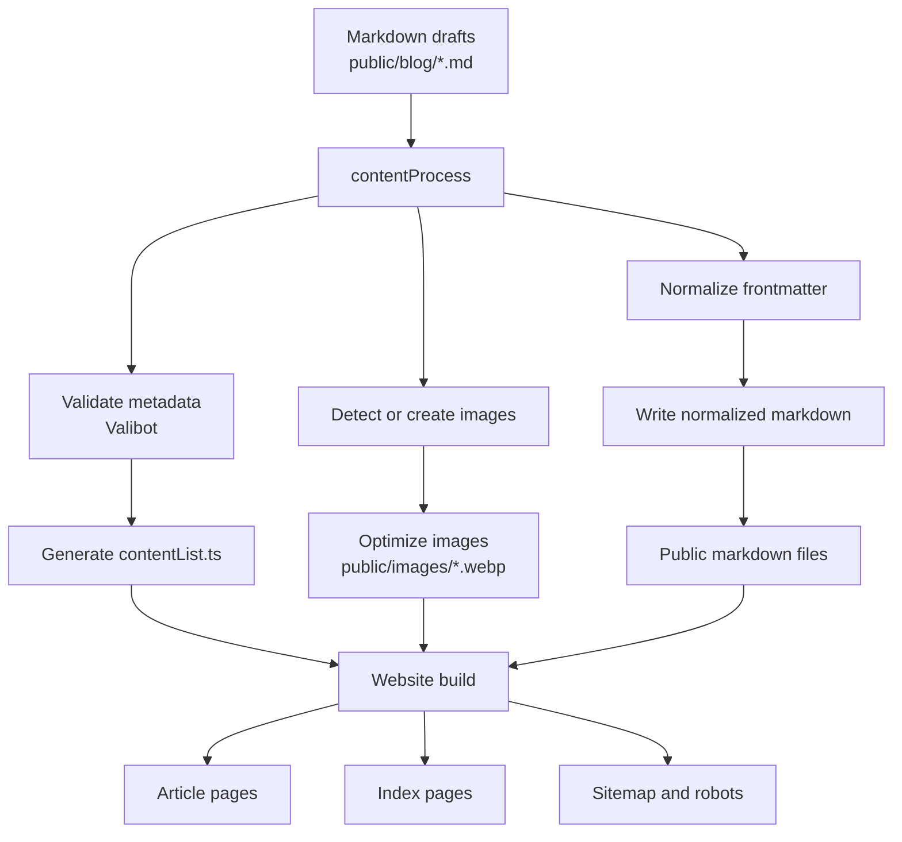
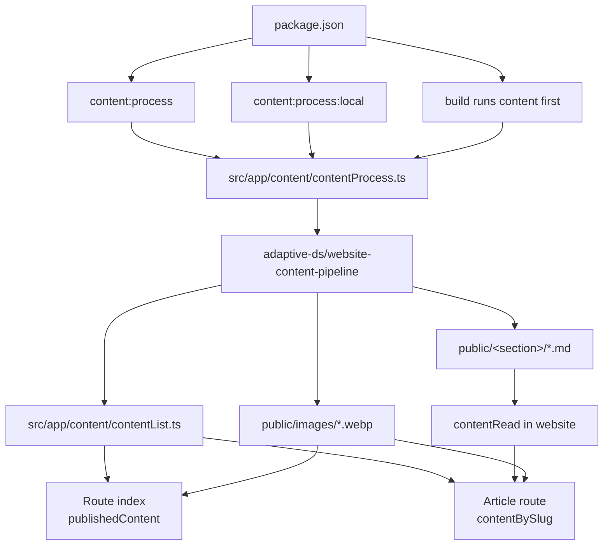
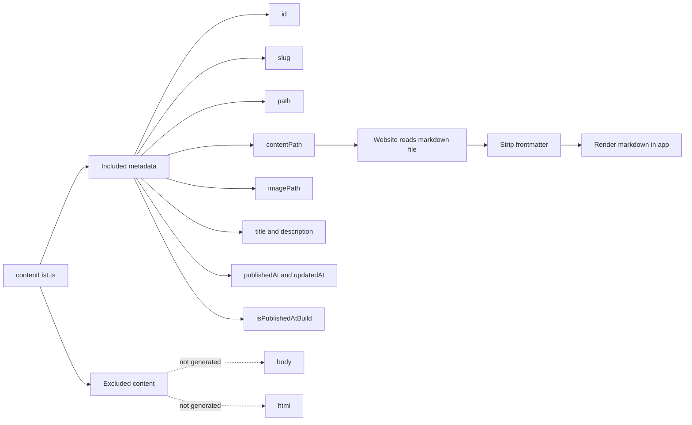
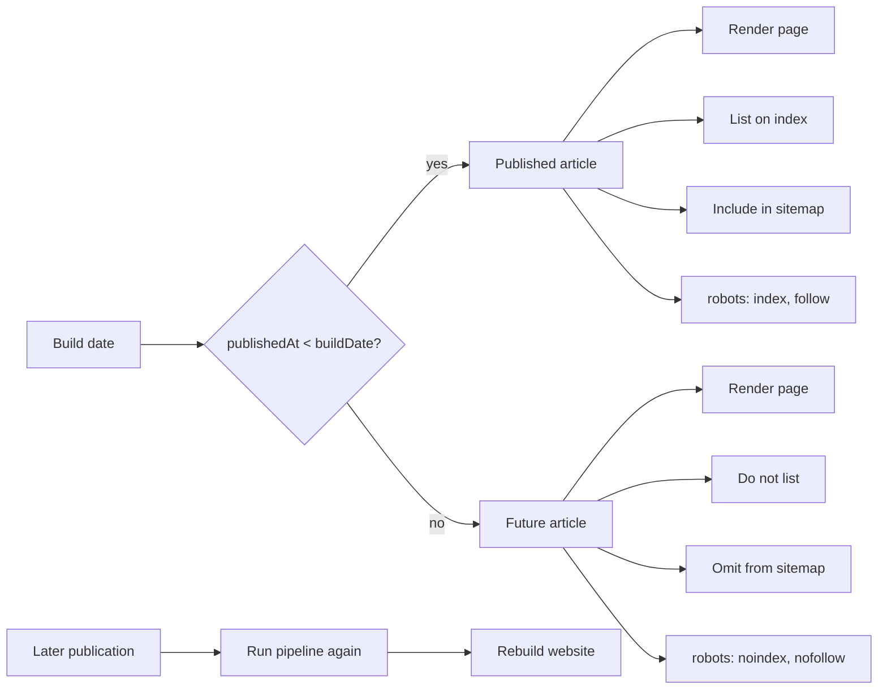

# @adaptive-ds/website-content-pipeline

Reusable markdown content pipeline for websites that publish scheduled articles from local content folders or synced remotes.

## Features

- parses markdown files named `yyyy-mm-dd-{slug}.md`
- normalizes missing frontmatter and writes it back to the markdown file
- validates frontmatter with `valibot`
- copies raw markdown files to a public content folder
- generates a typed `contentList.ts` with metadata and markdown file paths
- marks future-dated content as rendered but not published at build time
- detects missing featured images and creates prompt files
- can ask `codex` to generate missing images, with an ImageMagick fallback
- optimizes content images through `@adaptive-ds/assets-optimizer`
- optionally syncs source content and public content with `rclone`

## Diagrams

### End-To-End Pipeline



The package owns content processing and metadata generation. The website owns route rendering, SEO head generation, and final page composition.

### Project Integration



Typical integration calls the pipeline before SEO generation and before the framework build.

### Generated Content List Contract



The generated TypeScript stays small and framework-neutral. Consumers read markdown from `contentPath` when they render or prerender article pages.

### Build-Time Scheduling



Publishing future articles is intentionally tied to a later rebuild.


## Install

```bash
bun add -D @adaptive-ds/website-content-pipeline
```

## Usage

Create a project-local script such as `src/app/content/contentProcess.ts`:

```ts
#!/usr/bin/env bun

import { contentProcess } from "@adaptive-ds/website-content-pipeline"

await contentProcess({
  contentSection: "blog",
  contentDir: "./public/blog",
  imagePromptsDir: "./src/app/content/image-prompts",
  contentListOutputPath: "./src/app/content/contentList.ts",
  imageOriginalsDir: "./images",
  imageOptimizedDir: "./public/images",
})
```

`contentSection` controls the default public URL and output folder. For example, `contentSection: "blog"` defaults to `publicPathBase: "/blog"`, `publicBlogDir: "./public/blog"`, and `publicContentDir: "./public/blog"`. Use another section such as `"articles"` or `"ratgeber"` for websites that publish under a different route.

If you need separate source and public folders, pass `contentDir` and `publicContentDir` explicitly. The generated `contentPath` always points to the markdown file that should be read by the website at build/render time.

Then add a script:

```json
{
  "scripts": {
    "content:process": "bun run ./src/app/content/contentProcess.ts"
  }
}
```

## Frontmatter

Supported frontmatter fields:

- `title`
- `description`
- `publishedAt`
- `updatedAt`
- `author`
- `slug`
- `image`
- `imageAlt`

If `image` is not set, the pipeline assumes the image key is the markdown filename without `.md`.

## Generated Content List

The generated list exports:

- `buildDate`
- `contentList`
- `allContent`
- `contentBySlug(slug)`
- `isPublishedAtBuild(entry)`
- `publishedContent()`

Future-dated entries are included in `contentList`, so static routes can render them, but `publishedContent()` filters them out for indexes, links, sitemap generation, and other public listing surfaces.

`contentList` intentionally does not include markdown body or rendered HTML. Each entry includes `contentPath`, a project-relative path such as `./public/blog/2026-05-20-example-post.md`, so the website can read the source markdown and strip frontmatter at render/build time.

If the source markdown already lives in the public section folder, for example `contentDir: "./public/blog"`, the pipeline writes normalized frontmatter in place and avoids copying the file onto itself.

## Image Convention

Source images should live under transform folders consumed by `@adaptive-ds/assets-optimizer`, for example:

```text
images/
  1920x1080_webp/
    2026-05-20-example-post.jpg
```

When an image is missing, the fallback image target is:

```text
images/1920x1080_webp/{imageKey}.jpg
```

## Sync Flags

The `contentProcess()` helper understands these CLI flags from `process.argv`:

- `--sync`: sync local content from `sourceRemote` and sync public content to `destinationRemote`
- `--resync`: pass `--resync` to `rclone bisync`
- `--strict`: exit on recoverable validation, sync, or optimization errors

## Requirements

- `bun`
- `rclone` for sync mode
- `codex` if enabled and available for image generation
- `magick` for deterministic fallback images
